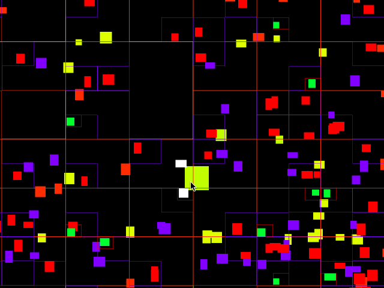

# QuadTree
A C# QuadTree implementation specifically designed for testing AABB collisions in 2D space.



## What does it do?
A [QuadTree](https://en.wikipedia.org/wiki/Quadtree) is a way of partitioning 2D space by recursively subdividing it into quads. This implementation allows you to insert rectangles into a QuadTree and check for collisions against them. Doing this can massively reduce collision checking time compared to having all your rectangles in a single list and checking for collision against each of them individually.

## Example Code
Here is some samples of how to use this QuadTree. In this example, I am using `QuadTree<int>`, but if you were developing a game you might use more convenient values, such as `QuadTree<GameObject>` or `QuadTree<ICollidable>`.

```csharp
//Create our quad tree and a list of quads
var tree = new QuadTree<int>(50, 0f, 0f, 1000f, 1000f);
var quads = new List<Quad>();

//Insert our first quad at position 0
var firstQuad = new Quad(50f, 50f, 100f, 100f);
tree.Insert(0, ref firstQuad);
quads.Add(firstQuad);

//Insert 1000 more random quads into the tree at positions 1-1000
var random = new Random();
for (int i = 0; i < 1000; ++i)
{
    var x = (float)random.NextDouble() * 950f;
    var y = (float)random.NextDouble() * 950f;
    var w = 10f + (float)random.NextDouble() * 40f;
    var h = 10f + (float)random.NextDouble() * 40f;
    var quad = new Quad(x, y, x + w, y + h);
    tree.Insert(quads.Count, ref quad);
    quads.Add(quad);
}

//Find all the quads in the tree that collide with quad 0 (our first quad)
var collisions = new List<int>();
if (tree.FindCollisions(0, ref collisions))
{
    //Print out all the colliding quads
    for (int i = 0; i < collisions.Count; ++i)
    {
        Console.WriteLine("Colliding quads: 0 -> {0}", collisions[0]);
    }
}

//Find all the quads in the tree that overlap a specific position
if (tree.SearchPoint(750f, 600f, ref collisions))
{
    //Print out all the colliding quads
    for (int i = 0; i < collisions.Count; ++i)
    {
        Console.WriteLine("Point inside quad: {0}", collisions[0]);
    }
}
```
